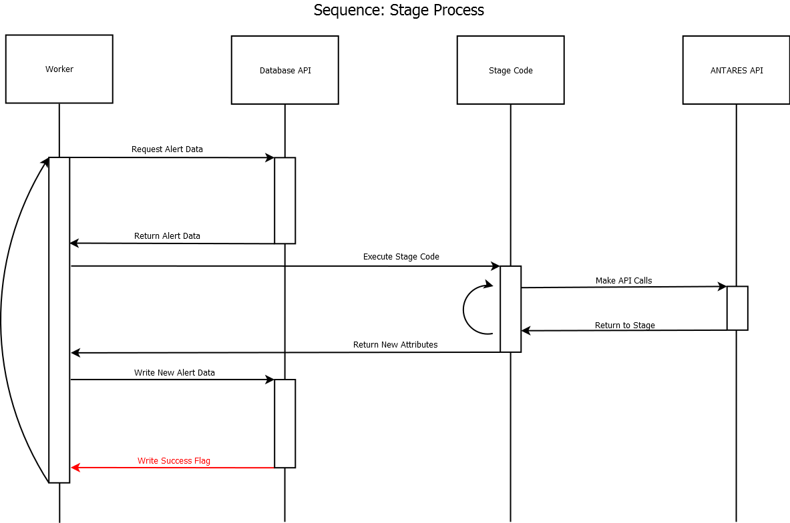
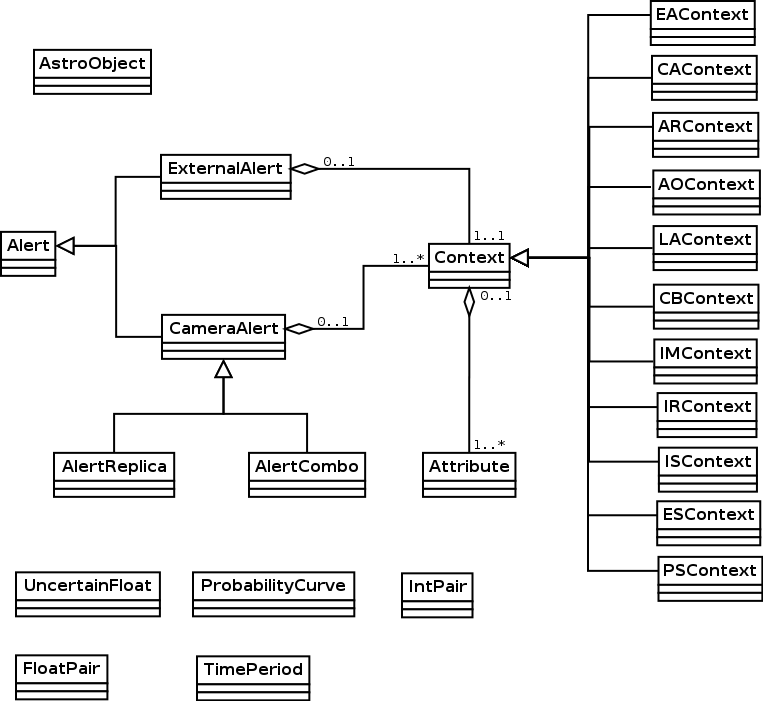

.. Antares API documentation master file, created by
   sphinx-quickstart on Tue Mar 10 20:02:16 2015.
   You can adapt this file completely to your liking, but it should at least
   contain the root `toctree` directive.

#################################
Antares Documentation
#################################

.. image:: ./_static/antares.png
   :width: 100px
   :height: 100px

Welcome to Antares documentation.

*************
API reference
*************
The ANTARES system, at its core, analyzes new data generated by the LSST in order to present astronomically interesting phenomena to scientists.  Thus, the system determines and filters regular activity from the more interesting data astronomers wish to investigate further.  In order to do this, ANTARES allows astronomers to develop code for use in analyzing the rarity of the observations.

When the LSST completes and transmits an exposure to ANTARES, that exposure is XOR'd with previous exposures of the same segment of the sky; differences between exposures are entered into ANTARES as sets of Camera Alerts containing the data from the exposure.  Those Camera Alerts (and subsequently generated Alerts as will be discussed) are sent by ANTARES through the code developed by astronomers in stages which are run in a distributed system concurrently.  These code stages may determine that a Camera Alert is not sufficiently interesting to continue analysis and divert the alert, which instructs ANTARES to discard the alert and prevent further processing; Camera Alerts not diverted will proceed to further code stages for further processing.  In addition, stages may generate Alert Replicas- copies of a given Camera Alert- for parallel stage processing (each Replica Alert may be processed separately) or for use in Combo Alerts- a type of Alert which allows multiple Alerts to be processed together in a given stage as opposed to atomically on a single Camera Alert.  Stages may also access External Alerts- data from other telescopes- as well as known Astro Objects- known astrometric phenomena- and use them in Alert Combos for processing.

Data for processing is located in the Alert object(s).  Each Alert object organizes its data in Contexts and Attributes.  Alerts have Contexts, which in turn have Attributes.  Contexts allow for categorical organization of data; to illustrate, the Camera Alert context holds data related to the brightness of a Camera Alert and the Astro Object context holds currently known data (such as color intensity) regarding the Astro Object in question.  These Contexts hold any number of Attributes, which are variables generated by and/or used in the stage processing.  Some Contexts have a set of predefined Attributes populated by default, such as data inherently available in Camera Alerts from the LSST.

Within the ANTARES pipeline, stage code accesses the Alerts, Contexts, and Attributes, as well as helper functions, through the ANTARES API.  At the beginning of a stage, the ANTARES system- as defined in the API- passes the Alert for processing (including any Contexts and Attributes associated with as well as Replicas in the case of a Combo Alert) to the stage code; the ANTARES system retrieves this data from the Locus Aggregated Database (which is initially populated with data from the LSST).  At the end of the stage, ANTARES stores data generated and used by stages in the Locus Aggregated Database for use in further stages.  The helper functions supplied in the API, among other things, allows the stage code to direct what to do with an alert- discard, mark as rare, or simply continue processing- following the stage.

This document specifies the ANTARES API, which allows development of stage code for execution on the ANTARES system.

Alert related
^^^^^^^^^^^^^

.. toctree::
   :maxdepth: 2

   alert/general_alert
   alert/external_alert
   alert/camera_alert
   alert/alert_replica
   alert/alert_combo
   alert/astroobj

Context related
^^^^^^^^^^^^^^^

.. toctree::
   :maxdepth: 2

   context/context
   context/ca_context
   context/ar_context
   context/ao_context
   context/la_context
   context/cb_context
   context/ea_context
   context/im_context
   context/is_context
   context/ir_context
   context/ps_context
   context/es_context

Attribute related
^^^^^^^^^^^^^^^^^

.. toctree::
   :maxdepth: 2

   attribute/attribute
   attribute/uncertain_float
   attribute/int_pair
   attribute/float_pair
   attribute/prob_curve
   attribute/time_period

Helper functions
^^^^^^^^^^^^^^^^^

.. toctree::
   :maxdepth: 2

   helper/index

Pre-defined Attribute
^^^^^^^^^^^^^^^^^^^^^

.. toctree::
   :maxdepth: 2

   attribute/predefined

*************************
Class inheritance diagram
*************************

Class inheritance relationship
^^^^^^^^^^^^^^^^^^^^^^^^^^^^^^

:py:class:`antares.alert.Alert` is the superclass for
:py:class:`antares.alert.CameraAlert` and 
:py:class:`antares.alert.ExternalAlert`.

:py:class:`antares.alert.CameraAlert` is the superclass for
:py:class:`antares.alert.AlertReplica` and
:py:class:`antares.alert.AlertCombo`.

:py:class:`antares.context.Context` is the superclass for the other 11
context classes.

Class composition relationship
^^^^^^^^^^^^^^^^^^^^^^^^^^^^^^

An :py:class:`antares.alert.ExternalAlert` has exactly one
:py:class:`antares.context.Context`, which is :py:class:`antares.context.EAContext`.

A :py:class:`antares.alert.CameraAlert` has one to many
:py:class:`antares.context.Context`.

A :py:class:`antares.context.Context` has one to many :py:class:`antares.attribute.Attribute`.

*********************
Rules & Constraints
*********************

.. toctree::
   :maxdepth: 2

   rules_constraints.rst

*********************
Examples
*********************

.. toctree::
   :maxdepth: 2

   examples/examples.rst

************************
Assumptions and Comments
************************
* The atomic alerts (including Combo and Replica Alerts) can be processed entirely in parallel and entirely independently of one another.  If a stage requires Attributes from earlier stages, it will only be executed after those earlier stages (this in part relies on stage configuration).  Only one stage may be executed on each Alert at a given time.

NOTE: we decided to leave for later discussion the identification of structures of camera alerts within an image (e.g., a cluster of say 100 alerts within a small area). We can incorporate such identification as a separate analysis, outside that of the stages.  This may be done through the creation of Combo Alerts in stage processing, but algorithms independant of the stages may prove more effective.

* Each Alert within a stage will have access only to Attributes within that Alert.

* Values of an attribute in a larger context (e.g., Image) will be the same across the relevant alerts (e.g., for every alert in that Image, for every alert in that RAFT).  **Note: Discuss this point with Rick.  Make clear- stages may not change Parameters for alerts outside of that stage.**

* Each alert within a stage will write a new value for one or more attributes within multiple contexts.

* Values cannot be written for a larger context (e.g., Image) within an alert stage. So a camera alert can write to attributes in the CA context but not to the Image or AstroObject contexts.  **Which contexts are writable?  Just CA?**

Note: the Antares Data Model document (https://docs.google.com/document/d/1xjYmhd8W9pyiwCBLA6o8mJeAz99Qbz9NvYFpICvYfSA/) had an example of

.. code-block:: python

   LA-LightCurve = F2( LA-CameraAlerts.TimeSeries(CA-Brightness), CA-Brightness, CA-Time )

Such an assignment would be allowed within a camera alert, because a Locus-Aggregated Alert (LA) has exactly one Camera Alert (CA) at any time. However, that would not be allowed within a replica or combo.

NOTE: We discussed computing something like the count of the number of alerts by allowing something like

.. code-block:: python

   IM-CountAlerts =+ 1

which reads IM-CountAlerts, adds one, and writes it. That is explicitly forbidden above. However, for such *accumulative* calculations, there may be ways to incorporate them by having a separate process that accepts such accumulations and coalesces them into a single assignment, rather than a complex sequence of parallel reads and write, which we want to avoid allowing.

* Written values are stored in the database only when a stage completes. A stage that is aborted loses those values, because the stage was incomplete.

* An attribute can be written to multiple times in a stage or in separate stages, but only the last value will be visible in subsequent stages or in output for a particular camera alert. (We allow this because different astronomers might have independently written different stages.)

* The values form a time series, one value computed for each alert at that time. Hence, old values are retained and the new value extends the time series. No value is ever changed in the database (except for multiple writes, discussed above, which we can finesse.).  In other words, each stage generates a new database entry.  The entire history of alert processing will be present in the database, with one new write per stage and no modification of old (and perhaps stale) stage values.

* There will be a separate conversion process that will translate the highly-optimized storage structure used in the ANTARES pipeline to and from the traditional relational structure as described in the ER diagram.  The latter representation will be best for cross-alert analyses. The conversion(s) and cross-alert analyses will happen outside the time-critical portion of ANTARES and may be challenging in their own way in terms of performance.
  
* User-contributed stages write to attributes associated with a context of the current alert. So a single stage or multiple stages could successively write to the same attribute, changing its value as the processing pipeline progresses. We retain the value as of the end of each stage, but a future alert at the same locus will only see the final value of that attribute: there is no facility for seeing an intermediate value within a stage or between stages of a single past alert at that locus.

* User-contributed stages can also write to local variables during their processing, but such variables will not be persisted between stages. The only values that are persisted are those associated with the contexts of the alert.

******************
Indices and tables
******************

* :ref:`genindex`
* :ref:`modindex`
* :ref:`search`

