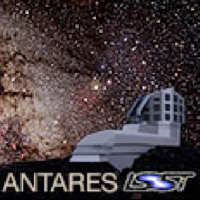

.. Antares API documentation master file, created by
   sphinx-quickstart on Tue Mar 10 20:02:16 2015.
   You can adapt this file completely to your liking, but it should at least
   contain the root `toctree` directive.

#################################
Antares Documentation
#################################

Welcome to Antares documentation.

**********
API
**********

**Alert related**

.. toctree::
   :maxdepth: 2

   alert/general_alert
   alert/external_alert
   alert/camera_alert
   alert/alert_replica
   alert/alert_combo

**Context related**

.. toctree::
   :maxdepth: 2

**Attribute related**

.. toctree::
   :maxdepth: 2

*************************
Class inheritance diagram
*************************

*********************
Rules & Constraints
*********************

.. toctree::
   :maxdepth: 2

   rules_constraints/index

*********************
Examples
*********************

Indices and tables
==================

* :ref:`genindex`
* :ref:`modindex`
* :ref:`search`

